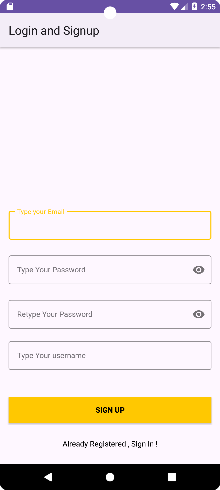
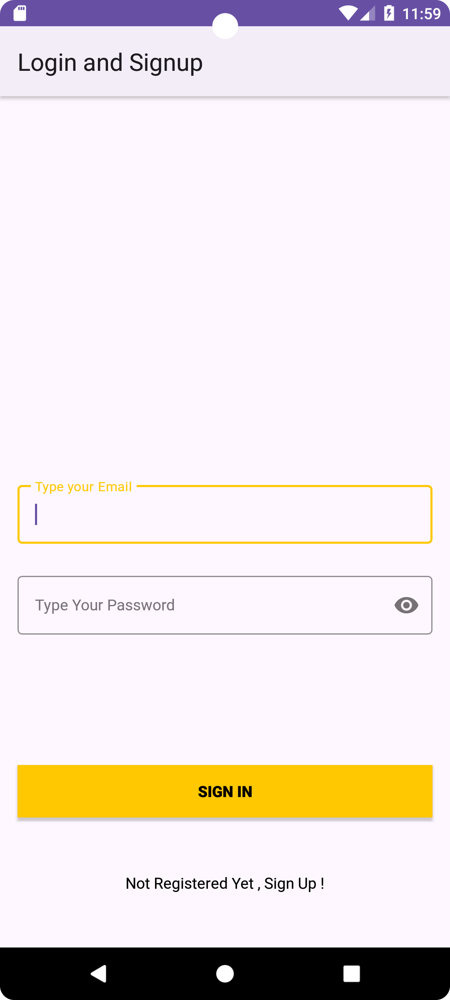
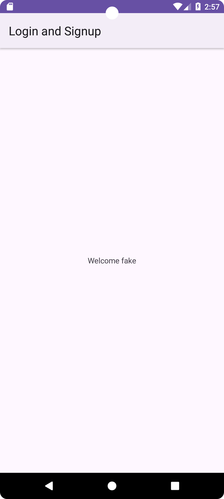

# Signup and Signin 

This Android application demonstrates the implementation of Firebase Authentication using email and password. Users can sign up with a new account, sign in with an existing account. The app also stores the user's username in the Firebase Firestore database upon registration.

## Features

- Sign Up: Users can create a new account by providing their email, password, and username.
- Sign In: Existing users can sign in with their email and password.
- Firebase Integration: Utilizes Firebase Authentication for user authentication and Firestore for storing user data.

## Dependencies

- Firebase Authentication
- Firebase Firestore

  ## Setup

To run the MyWallet app on your local machine, follow these steps:

- Clone the repositories to your local computer.
```bash
  git clone https://github.com/your-username/mywallet-app.git
  
```
- Open the project in Android Studio.
- Build and run the project on an Android emulator or physical device.

  ## Screenshots

| Screenshot 1 | Screenshot 2 | Screenshot 3 |
|:-------------:|:-------------:|:-------------:|
|  |  |  |

## Acknowledgment

This app was created for educational purposes and is inspired by various Firebase Authentication tutorials and documentation.

